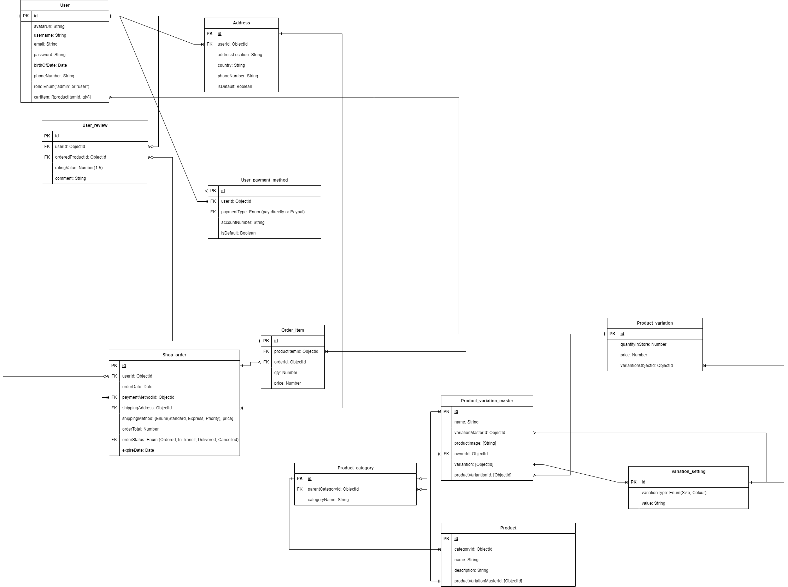

# E-commerce clothes store web

## Project description

E-commerce clothes store is convenient online platform developed to help customers easily to buy clothes online. It also provides a real-time chat between customer and owner for those who want to know more about the product they intend to buy.

E-commerce clothes store web also provides shop owners with an intuitive interface for owners to manage product in store and add a sale to a product or a specific variant of a product.

## Backend

### Authentication

- [ ] Registering for a new account with name, email and password
- [ ] Signing in with email and password
- [ ] Register quickly with gmail
- [ ] Reset password when forget

### Users

- [ ] User three type: User without sign in, User sign in, Admin

**User without sign in**

- [ ] User can search for a specific product
- [ ] User can filter products on various parameters
- [ ] User can sort products according to price and name
- [ ] User can add products to cart
- [ ] User can order products by providing their shipping information and only pay directly
- [ ] User can view the feedback of a product
- [ ] User can chat with the shop owner

**User sign in**

- Have all features of user without sign in
- [ ] User can view their order'status and their previous order
- [ ] User can leave feedback, update or delete to the product
- [ ] User can apply code to get the product with the lower price
- [ ] User can change their information like avatar, address, phone number.
- [ ] Withdraw if user pay with credit card

**Admin**

- Have all features of user sign in
- [ ] Can view all product with the quantity of that product
- [ ] Can add, update, delete the product or variant of product
- [ ] Can view orders and update their status
- [ ] Chat with user
- [ ] Create code for discount products or variants
- [ ] Seller dashboard: Sale performance data visualization

## Entity Relationship Diagram



## API Endpoints

## Auth APIs

```javascript
/**
 * @route POST /auth/login
 * @description Log in with username and password
 * @body {username, password}
 * @access Public
 */
```

```javascript
/**
 * @route POST /users
 * @description User Registration
 * @body {username, email, password}
 * @access Public
 */
```

### User APIs

```javascript
/**
 * @route GET /users/me
 * @description Get current user info
 * @access Login required
 */
```

```javascript
/**
 * @route PUT /users/:id
 * @description Update user profile
 * @body {avatarUrl, password, birthOfDate, phoneNumber, cartItemId, addressId}
 * @access Login required (Admin)
 */
```

```javascript
/**
 * @route PUT /users/me
 * @description Update user profile
 @body {avatarUrl, password, birthOfDate, phoneNumber, cartItemId, addressId}
 * @access Login required 
*/
```

```javascript
/**
 * @route GET /admin/users
 * @description Get all users with filter
 * @access Login required (Admin)
 */
```

```javascript
/**
 * @route GET /users/:id
 * @description Get detail of a user
 * @access Login required (Admin)
 */
```

```javascript
/**
 * @route POST /users
 * @description Create a user
 * @access Login required (Admin)
 */
```

```javascript
/**
 * @route DELETE /users/:id
 * @description Delete user account
 * @access Login required (Admin)
 */
```

```javascript
/**
 * @route DELETE /users/me
 * @description Delete user account
 * @access Login required
 */
```

<!-- ### Cart APIs

```javascript
/**
 * @route GET /users/:id/cart/:productItemId
 * @decription Get detail of a specific product in cart
 * @access Login required
 */
```

```javascript
/**
 * @route POST /users/:id/cart
 * @description Create a product in user cart
 * @body {productItemId, qty}
 * @access Login required
 */
```

```javascript
/**
 * @route PUT /users/:id/cart/:cartItemId
 * @description Update a product in user cart
 * @body {qty}
 * @access Login required
 */
```

```javascript
/**
 * @route DELETE /users/:id/cart/:cartItemId
 * @description Delete a product in user
 * @access Login required
 */
``` -->

<!-- ### Address APIs

```javascript
/**
 * @route GET /users/:id/address
 * @description Get all address of a user
 * @access Login required
 */
```

```javascript
/**
 * @route GET /users/:id/address/:addressId
 * @description Get detail of an address
 * @access Login required
 */
```

```javascript
/**
 * @route POST /users/address
 * @description Create an address of a user
 * @body {userId, addressLocation, country, phoneNumber, isDefault}
 * @access Login required
 */
```

```javascript
/**
 * @route PUT users/:id/address/:adrressId
 * @description Update an address of a user
 * @body {addressLocation, country, phoneNumber. isDefault}
 * @access Login required
 */
```

```javascript
/**
 * @route DELETE users/:id/address/:addressId
 * @description Delete an address of a user
 * @access Login required
 */
``` -->

### Review APIs

```javascript
/**
 * @route GET /reviews/products/:productItemId
 * @description Get all the product reviews
 * @access Public
 */
```

```javascript
/**
 * @route GET /reviews
 * @description Get all user reviews
 * @access Login required
 */
```

```javascript
/**
 * @route POST /reviews
 * @description Create a review for a product
 * @body {userId, productVariationId, ratingValue, comment, imageUrl}
 * @access Login required
 */
```

```javascript
/**
 * @route PUT /reviews/:reviewId
 * @description Update a review of a product
 * @body {ratingValue, comment, imageUrl}
 * @access Login required
 */
```

```javascript
/**
 * @route DELETE /reviews/:reviewId
 * @description Delete a review
 * @access Login required
 */
```

### Payment method APIs

```javascript
/**
 * @route GET admin/payment
 * @description Get all payment method
 * @access Login required (Admin)
 *
 */
```

<!-- ```javascript
/**
 * @route GET users/payment
 * @description Get all payment method
 * @access Login required
 *
 */
``` -->

```javascript
/**
 * @route POST admin/payment
 * @description Create a new payment method
 * @body {account, paymentMethod}
 * @access Login required (Admin)
 */
```

```javascript
/**
 * @route PUT admin/payment/:paymentId
 * @description Update a payment method
 * @body {accountNumber, paymentMethod}
 * @access Login required (Admin)
 */
```

```javascript
/**
 * @route DELETE admin/payment/:paymentId
 * @description Delete a payment method
 * @access Login required (Admin)
 */
```

### Order APIs

```javascript
/**
 * @route GET admin/orders
 * @description Get all orders
 * @access Login required (Admin)
 */
```

```javascript
/**
 * @route GET /orders
 * @description Get all orders of a user
 * @access Login required
 */
```

<!-- ```javascript
/**
 * @route GET admin/orders/:orderId
 * @description Get specific detail of order list
 * @access Login required (Admin)
 */
``` -->

```javascript
/**
 * @route GET /orders/:orderId
 * @description Get specific detail of order list
 * @access Login required
 */
```

```javascript
/**
 * @route POST /orders
 * @description Create an order
 * @body {userId, orderItem, orderDate, paymentMethod, account, shippingAddress, shippingMethod, orderStatus}
 * @access Login required
 */
```

<!-- ```javascript
/**
 * @route PUT admin/orders/:orderId
 * @description Update order status
 * @body {orderStatus}
 * @access Login required (Admin)
 */
``` -->

```javascript
/**
 * @route PUT /orders/:orderId
 * @description Update order list
 * @body {orderItem, orderDate, paymentMethod, account, shippingAdress, shippingMethod, orderStatus}
 * @access Login required
 */
```

### Product category APIs

```javascript
/**
 * @route GET /category
 * @description Get all the category of e-commerce shop
 * @access Login required
 */
```

<!-- ```javascript
/**
 * @route GET admin/category
 * @description Get all the category of e-commerce shop
 * @access Login required (Admin)
 */
``` -->

```javascript
/**
 * @route POST admin/category
 * @description Create a category name
 * @body {parentCategoryId, categoryName}
 * @access Login required (Admin)
 */
```

```javascript
/**
 * @route PUT admin/category/:categoryId
 * @description Update a category
 * @body {parentCategoryId, categoryName}
 * @access Login required (Admin)
 */
```

### Variation APIs

```javascript
/**
 * @route GET admin/variation
 * @description Get all variation
 * @access Login required (Admin)
 */
```

```javascript
/**
 * @route POST admin/variation
 * @description Create a variation
 * @body {variationType, value}
 * @access Login required (Admin)
 */
```

```javascript
/**
 * @route PUT admin/variation/:variationId
 * @description Update a variation
 * @body {value}
 * @access Login required (Admin)
 */
```

### Products APIs

- Use Product_variation_master collection

```javascript
/**
 * @route GET /products
 * @description Get the products
 * @query {name, color, size, sortByPrice}
 * @access Login required
 */
```

<!-- - Use Product_variation_master collection

```javascript
/**
 * @route GET admin/products
 * @description Get the products
 * @query {name, color, size, sortByPrice}
 * @access Login required (Admin)
 */
``` -->

- Use Product_variation_master collection

```javascript
/**
 * @route GET /products/:productId
 * @description Get the product detail
 * @access Login required
 */
```

<!-- - Use Product_variation_master collection

```javascript
/**
 * @route GET admin/products/:productId
 * @description Get the product detail
 * @access Login required (Admin)
 */
``` -->

- Use Product collection

```javascript
/**
 * @route GET admin/products/productParents
 * @description Get the products parent
 * @query {name, color}
 * @access Login required (Admin)
 */
```

```javascript
/**
 * @route GET admin/products/productParents/:productParentId
 * @description Get the product parent detail
 * @access Login required (Admin)
 */
```

- Use Product collection

```javascript
/**
 * @route GET /products/silbling/:productId
 * @description Get the silbling of product variation master
 * @access Login required
 */
```

<!-- - Use Product collection

```javascript
/**
 * @route GET admin/products/silbling/:productId
 * @description Get the silbling of product variation master
 * @access Login required (Admin)
 */
``` -->

- Use Product collection

```javascript
/**
 * @route POST admin/products
 * @description Create a product in e commerce website
 * @body {name, description, categoryId}
 * @access Login required (Admin)
 */
```

```javascript
/**
 * @route POST admin/products/:productId/variationMasterProduct
 * @description Create a product variation master
 * @body {name, productImage, ownerId, description, price, variationMasterId}
 * @access Login required (Admin)
 */
```

```javascript
/**
 * @route POST admin/products/:productId/variationMasterProduct/:variationMasterProductId/variation
 * @description Create a product variation
 * @body {quantityInStore, description, variationObjectId}
 * @access Login required (Admin)
 */
```

```javascript
/**
 * @route PUT admin/products/:productId
 * @description Update a product
 * @body {name, description}
 * @access Login required (Admin)
 */
```

```javascript
/**
 * @route PUT admin/products/:productId/variationMaster/:variationMasterId
 * @description Update a product variation master
 * @body {name, description, productImage, price}
 * @access Login required (Admin)
 */
```

```javascript
/**
 * @route PUT admin/products/:productId/variationMaster/:variationMasterId/variation/:variationId
 * @description Update a product variation
 * @body {quantityInStore, description, isActive}
 * @access Login required (Admin)
 */
```

```javascript
/**
 * @route DELETE admin/products/:productId
 * @description Delete a product
 * @access Login required (Admin)
 */
```

```javascript
/**
 * @route DELETE admin/products/:productId/variationMaster/:variationMasterId
 * @description Delete a product variation master
 * @access Login required (Admin)
 */
```

```javascript
/**
 * @route DELETE admin/products/:productId/variationMaster/:variationMasterId/variation/:variationId
 * @description Delete a product variation
 * @access Login required (Admin)
 */
```
